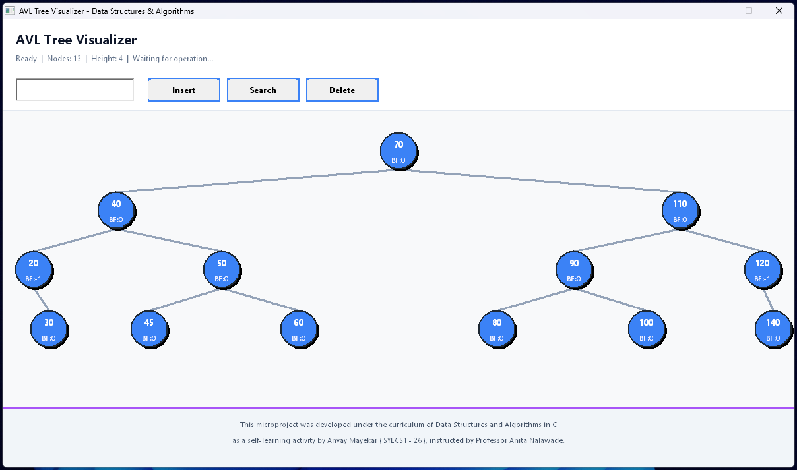

# 🌲 AVL Tree Visualizer

A high-performance **Windows GUI application** for visualizing AVL Tree operations in real-time, built with **pure C** and the **Win32 API**. Features include live tree rendering, rotation animations, balance factor display, and microsecond-precision performance metrics.

> 🎓 This project was developed as part of **Data Structures and Algorithms in C** coursework at **Shah & Anchor Kutchhi Engineering College**, Mumbai by **Anvay Mayekar (SYECS1 - 26)**, under the guidance of **Professor Anita Nalawade**.

---

## 📸 Demo

<p align="center">
  
</p>


---

## 📚 About AVL Trees

An **AVL tree** (named after inventors Adelson-Velsky and Landis) is a self-balancing binary search tree where the height difference between left and right subtrees of any node—called the **balance factor**—never exceeds 1. This strict balancing property ensures that operations like insertion, deletion, and search maintain **O(log n)** time complexity in all cases, preventing the tree from degrading into a linked list structure that would result in O(n) operations.

When an insertion or deletion violates the AVL property, the tree automatically rebalances itself through **rotations**—either single (LL or RR) or double (LR or RL). These rotations are local operations that restructure subtrees without affecting the overall binary search tree ordering. This visualizer demonstrates these core concepts in real-time, allowing users to observe how balance factors update and which rotation types are triggered to maintain the tree's logarithmic height guarantee.

---

## ⚡ Complexity Analysis

### Time Complexity

| Operation   | Average Case | Worst Case | Description |
|-------------|--------------|------------|-------------|
| **Search**  | O(log n)     | O(log n)   | Balanced height guarantees logarithmic search |
| **Insert**  | O(log n)     | O(log n)   | Includes rebalancing with at most 2 rotations |
| **Delete**  | O(log n)     | O(log n)   | May require O(log n) rotations along path |
| **Rotation**| O(1)         | O(1)       | Constant-time pointer reassignment |

### Space Complexity

| Aspect              | Complexity | Notes |
|---------------------|------------|-------|
| **Tree Storage**    | O(n)       | One node per element stored |
| **Recursion Stack** | O(log n)   | Maximum depth for insert/delete operations |
| **Auxiliary Space** | O(1)       | No additional data structures needed |

> 💡 **Key Advantage:** Unlike unbalanced BSTs that can degrade to O(n) height, AVL trees maintain a strict height bound of **1.44 × log₂(n)**, ensuring predictable performance for all operations.

---

## ✨ Features

- **Real-time Visualization** — Watch AVL trees balance themselves dynamically
- **Interactive Operations** — Insert, Search, and Delete with visual feedback
- **Rotation Detection** — Identifies and displays LL, RR, LR, and RL rotations
- **Performance Metrics** — Microsecond-precision execution time tracking
- **Modern UI** — Clean, gradient-styled interface with node highlighting
- **Balance Factor Display** — Shows height and BF for every node
- **Smooth Rendering** — Double-buffered graphics with anti-aliasing

---

## 🗂️ Project Structure

```
avl-tree-visualizer/
├── build/                    # 🔩 Build output directory
│   ├── obj/                  # 🧱 Compiled object files (.o)
│   └── AVLTreeVisualizer.exe # 🟢 Windows executable
│
├── include/                  # 📂 Header files
│   ├── avl_tree.h           # 🌳 AVL tree data structures & operations
│   └── common.h             # 🎨 Constants, colors, window dimensions
│
├── src/                      # ⚙️  Source implementation
│   ├── avl_tree.c           # 🧮 Core AVL logic (insert, delete, rotate)
│   ├── gui.c                # 🖼️  Rendering & visualization
│   └── main.c               # 🚀 Entry point & event handling
│
├── sample/                   # 📸 Demo screenshots
│   └── demo.png
│
├── Makefile                  # 🔨 Build automation
└── README.md                 # 📘 Project documentation
```

---

## 🧰 Technologies Used


---

## 📦 Installation & Setup

### Prerequisites

- **Windows OS** (Win32 API dependency)
- **GCC Compiler** (MinGW recommended)
- **Make** (for build automation)

### 🔧 Build Instructions

```bash
# Clone the repository
git clone https://github.com/anvaymayekar/avl-tree-visualizer.git

# Navigate to project directory
cd avl-tree-visualizer

# Build the project
make

# Run the executable
./build/AVLTreeVisualizer.exe
```

### 🧹 Clean Build

```bash
make clean
```

---

## 🎮 Usage

1. **Insert Node** — Enter a value and click "Insert" or press `Enter`
2. **Search Node** — Input a value and click "Search" or press `F3`
3. **Delete Node** — Enter a value and click "Delete" or press `Delete`

### Keyboard Shortcuts

| Key          | Action        |
|--------------|---------------|
| `Enter`      | Insert Node   |
| `F3`         | Search Node   |
| `Delete`     | Delete Node   |

---

## 🧮 AVL Operations

| Operation   | Time Complexity | Space Complexity |
|-------------|-----------------|------------------|
| Insert      | O(log n)        | O(1)             |
| Delete      | O(log n)        | O(1)             |
| Search      | O(log n)        | O(1)             |
| Rotation    | O(1)            | O(1)             |

---

## 🎨 Visual Features

- **Node Highlighting** — Green for found nodes, red for rotations
- **Balance Factors** — Displayed inside each node
- **Tree Height** — Real-time height calculation
- **Rotation Tracking** — Shows LL/RR/LR/RL rotation types
- **Performance Stats** — Execution time in milliseconds

---

## ⚖️ License

This project is licensed under the [MIT License](https://opensource.org/licenses/MIT).  
You are free to use, modify, and distribute this software with proper attribution.

---

## 👨‍💻 Author

> **Anvay Mayekar**  
> 🎓 B.Tech in Electronics & Computer Science — SAKEC  
>  
> [](https://www.github.com/anvaymayekar)
> [](https://in.linkedin.com/in/anvaymayekar)
> [](https://www.instagram.com/anvaymayekar)

---
